# Stock Market Portfolio Optimization
## <h3 style="color:#4A90E2;">Objectives</h3>
Stock market portfolio optimization involves analyzing price trends, calculating expected returns and volatilities, and determining the correlations between different stocks to achieve diversification. Using techniques such as Modern Portfolio Theory (MPT), we can construct an efficient portfolio that relies on the efficient frontier to represent the optimal trade-off between risk and return.

The expected results from stock market portfolio optimization include identifying the portfolio with the highest Sharpe ratio, which indicates the best risk-adjusted return and provides a clear allocation strategy for the selected stocks to achieve long-term investment goals.

### <h3 style="color:#4A90E2;">Stock Market Performance</h3> 

Tracking the adjusted close prices of prominent stocks over time provides valuable insights into the trends and volatility of key companies. In this segement, we focus on four major stocks: HDFC Bank (HDFCBANK.NS), Infosys (INFY.NS), Reliance (RELIANCE.NS), and TCS (TCS.NS), examining how their adjusted close prices have evolved. By visualizing these trends, we aim to understand the comparative stability and growth of each stock, which is crucial for investors and analysts.

#### Code
```python
df['Date'] = pd.to_datetime(df['Date'])
df.set_index('Date', inplace = True)

plt.figure(figsize = (14,7))
sns.set(style = 'whitegrid')

sns.lineplot(data = df, x='Date', y='Adj Close', hue='Ticker', marker = 'o')

plt.title('Adjusted Close Price Over Time', fontsize=16)
plt.xlabel('Date', fontsize=14)
plt.ylabel('Adjusted Close Price', fontsize=14)
plt.legend(title='Ticker', title_fontsize='13', fontsize='11')
plt.grid(True)

plt.xticks(rotation=45)

plt.show()
```
#### Results

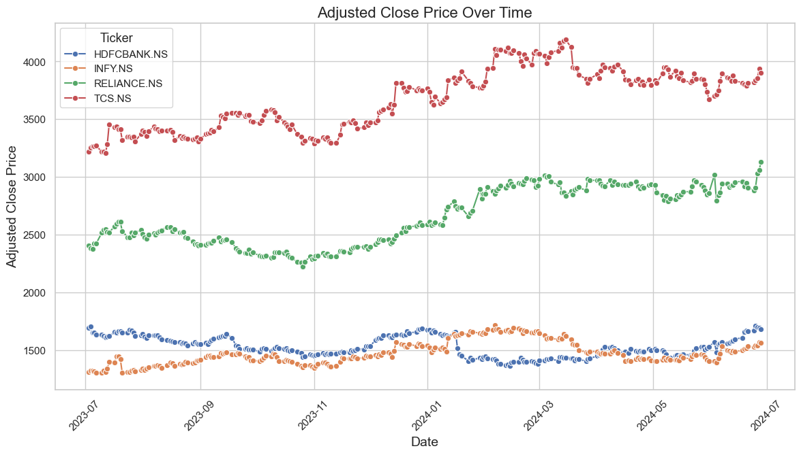

#### Key Insights

1) **TCS (TCS.NS)** maintains the highest adjusted close price among the four stocks throughout the observed period, indicating strong and stable performance in the market.
2) **Reliance (RELIANCE.NS)** shows considerable growth and is relatively stable, but experiences some fluctuations. The upward trend over the period reflects its strong market presence.
3) **Infosys (INFY.NS)**, represented in green, demonstrates less volatility and appears consistent with minor increases. Its performance suggests a steady growth trajectory.
4) **HDFC Bank (HDFCBANK.NS)** has the lowest adjusted close price among the stocks in this comparison. Its trend shows moderate stability, with a slight upward trend toward the end of the period, which may indicate future growth potential.

### <h3 style="color:#4A90E2;">Computing the 50-day and 200-day moving averages</h3>  

The 50-day and 200-day moving averages help identify stock trends: the 50-day tracks short-term movement, while the 200-day indicates long-term direction. Crossovers between them signal potential trend shifts, with the “Golden Cross” suggesting an uptrend and the “Death Cross” signaling a downtrend, guiding buy or sell decisions.

#### Code

``` python
short_window = 50
long_window = 200


df_tickers = df['Ticker'].unique()

for ticker in df_tickers:
    ticker_data = df[df['Ticker'] == ticker].copy()
    ticker_data['50_MA'] = ticker_data['Adj Close'].rolling(window = short_window).mean()
    ticker_data['200_MA'] = ticker_data['Adj Close'].rolling(window = long_window).mean()
    
    plt.figure(figsize = (14,7))
    plt.plot(ticker_data.index, ticker_data['Adj Close'], label = 'Adj Close')
    plt.plot(ticker_data.index, ticker_data['200_MA'], label = '200-Day-MA')
    plt.title(f'{ticker} - Adjusted Close and Moving Averages')
    plt.xlabel('Date')
    plt.ylabel('Price')
    plt.legend()
    plt.grid(True)
    plt.xticks(rotation = 45)
    plt.tight_layout()
    plt.show()

    plt.figure(figsize = (14,7))
    plt.bar(ticker_data.index, ticker_data['Volume'], label = 'Volume', color = 'orange')
    plt.title(f'{ticker} - Volume Traded')
    plt.xlabel('Date')
    plt.ylabel('Volume')
    plt.legend()
    plt.grid(True)
    plt.xticks(rotation = 45)
    plt.tight_layout()
    plt.show()
    
```

#### Results

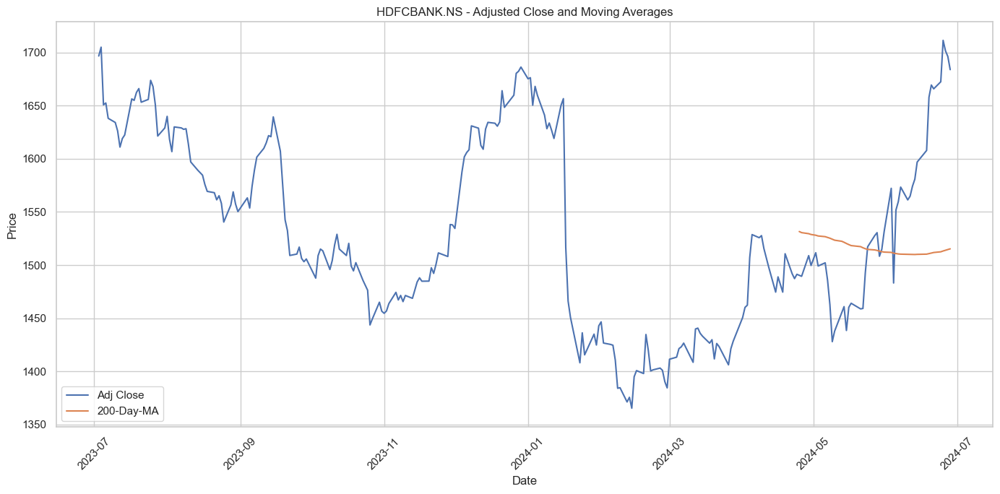
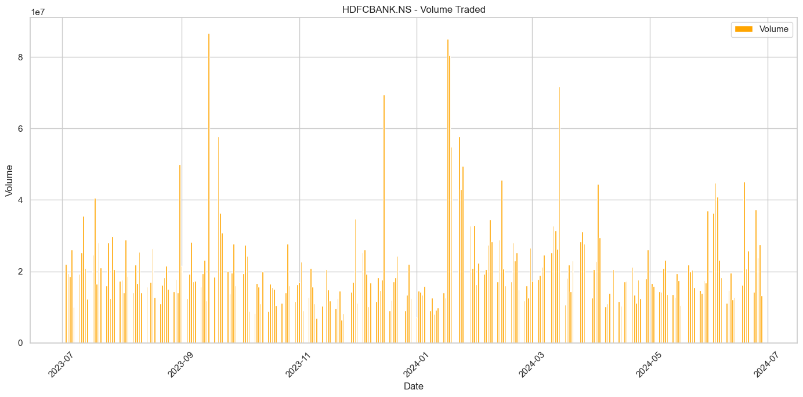
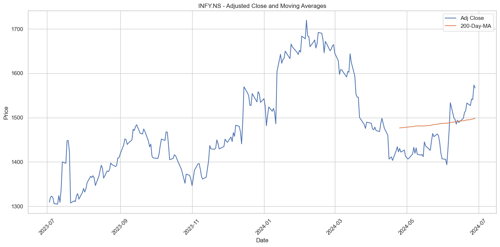
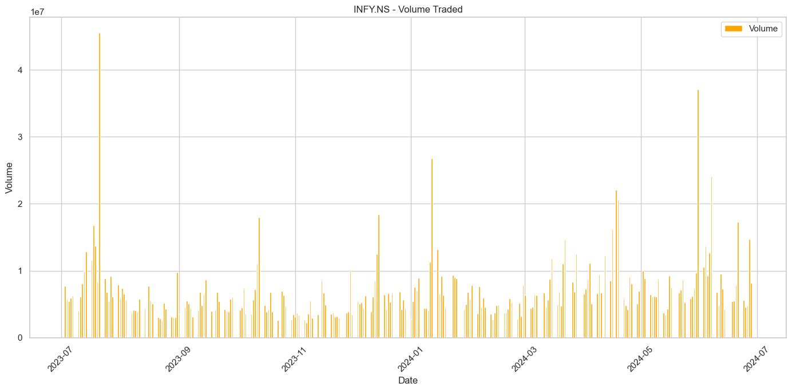
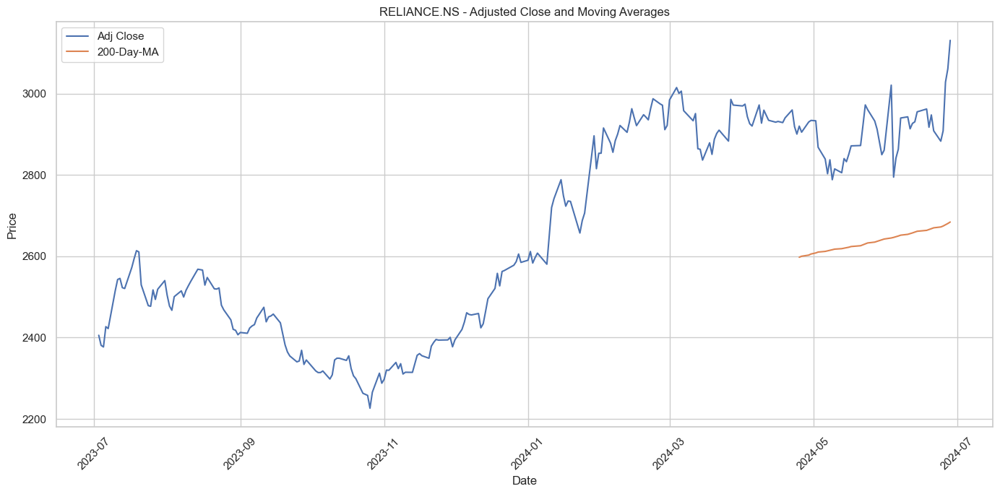
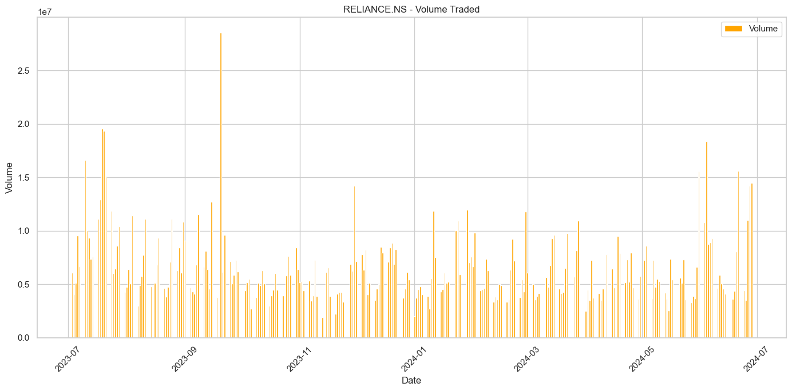
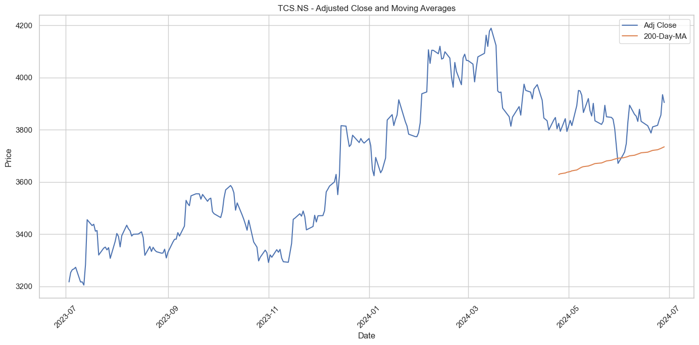
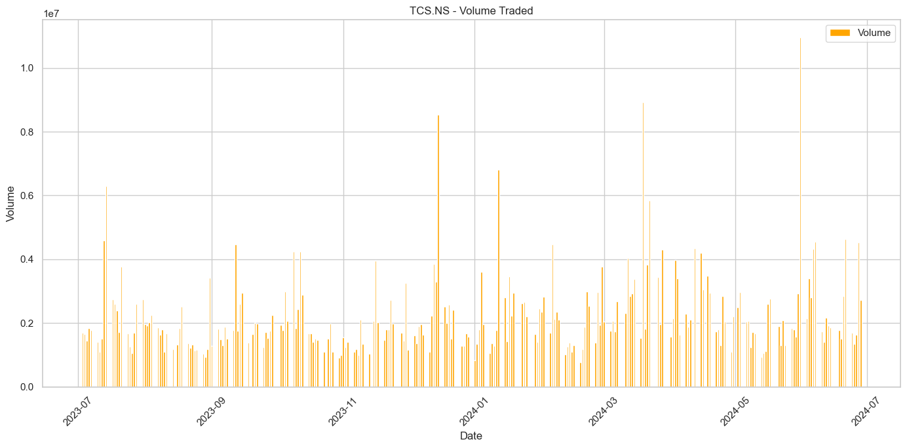

#### Key Insights

The analysis of moving averages reveals distinct trends across HDFCBANK, INFY, RELIANCE, and TCS. HDFCBANK and INFY initially show a decline but later indicate recovery, highlighting potential turnaround points. In contrast, RELIANCE and TCS demonstrate consistent upward movement, suggesting steady growth. Volume-traded data reveals key spikes, particularly for HDFCBANK and RELIANCE in early 2024, pointing to heightened trading activity that may signal market interest. These insights provide a foundational view of price trends and trading behaviors, supporting more informed investment decisions.

### <h3 style="color:#4A90E2;">Distribution of Daily Returns</h3> 

The distribution of daily returns is a key metric in understanding stock market behavior. By analyzing daily returns, we can observe volatility, identify patterns, and assess potential risks. This distribution helps us determine if returns follow a normal pattern or exhibit skewness and kurtosis, which may indicate outliers, trends, or anomalies. Understanding this distribution is essential for portfolio optimization, as it allows us to estimate expected returns and tailor risk management strategies accordingly.

#### Code

``` python
df['Daily_Return'] = df.groupby('Ticker')['Adj Close'].pct_change()

plt.figure(figsize=(14,7))
sns.set(style='whitegrid')

for ticker in df_tickers:
    ticker_data = df[df['Ticker'] == ticker]
    sns.histplot(ticker_data['Daily_Return'].dropna(), bins =50, kde= True, label = ticker, alpha =0.5)

    plt.title('Distribution of Daily Returns', fontsize=16)
plt.xlabel('Daily Return', fontsize=14)
plt.ylabel('Frequency', fontsize=14)
plt.legend(title='Ticker', title_fontsize='13', fontsize='11')
plt.grid(True)
plt.tight_layout()
plt.show()
```

#### Results

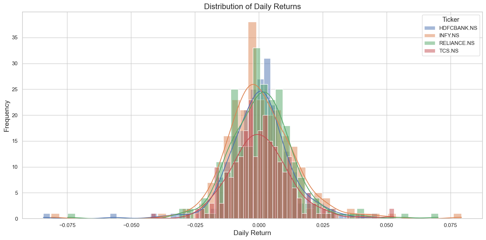

#### Key Insights

The daily returns for HDFC Bank, Infosys, Reliance, and TCS stocks display a roughly normal distribution centered around zero, indicating symmetry between positive and negative returns. Reliance has a wider distribution, suggesting higher volatility, while Infosys shows a narrower spread, implying lower short-term risk. HDFC Bank and TCS have moderate volatility, with relatively consistent daily returns. Occasional extreme values in all stocks suggest that significant price shifts can occur due to market events. Overall, this distribution analysis offers a snapshot of each stock's risk-return profile, highlighting variations in volatility across the portfolio.

###  <h3 style="color:#4A90E2;">Correlation between stocks</h3> 

Analyzing the correlation between stocks is crucial for effective portfolio diversification. Correlation measures how stocks move relative to each other: a high positive correlation means stocks often move in the same direction, while a low or negative correlation suggests they move independently or in opposite directions. By combining stocks with low or negative correlations, we can reduce overall portfolio risk, as declines in one stock may be offset by gains in another. This approach enhances risk-adjusted returns, making correlation analysis a fundamental tool in portfolio optimization.

#### Code

``` python
daily_returns = df.pivot_table(index= 'Date', columns= 'Ticker', values = 'Daily Return')
corr_mat = daily_returns.corr()

plt.figure(figsize=(12,10))
sns.set(style='whitegrid')

sns.heatmap(corr_mat, annot=True, cmap='coolwarm', linewidths=.5, fmt='.2f', annot_kws={"size": 10})
plt.title('Correlation Matrix of Daily Returns', fontsize = 16)
plt.xticks(rotation = 90)
plt.yticks(rotation = 0)
plt.tight_layout()
plt.show()
```

#### Results
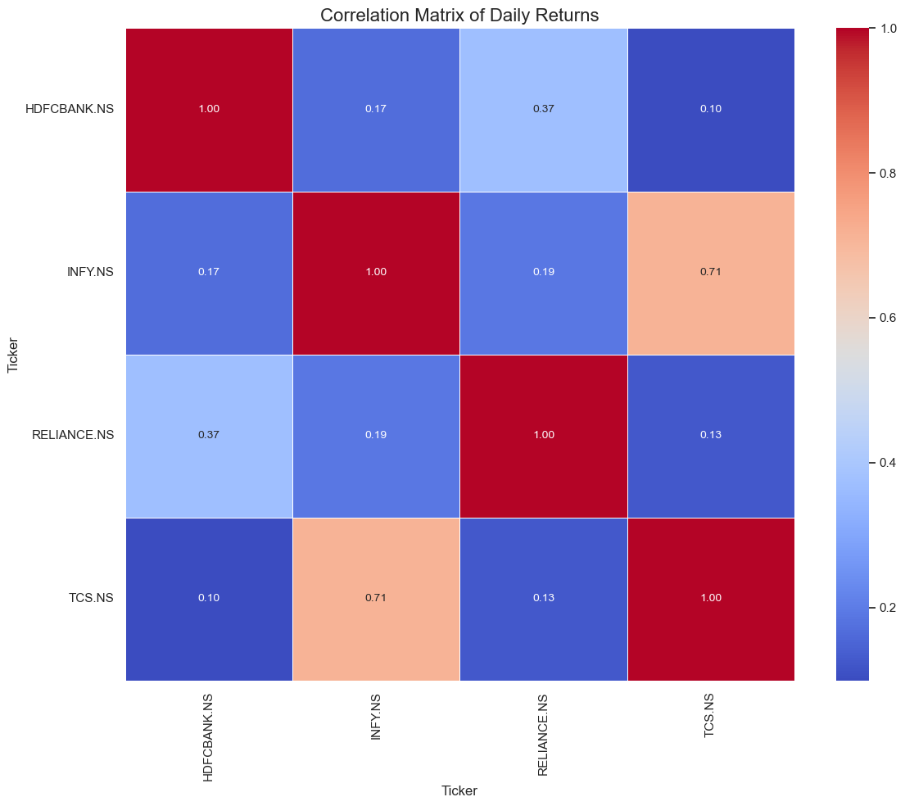

#### Key Insights 

The correlation analysis reveals that INFY and TCS have a strong positive correlation (0.71), indicating they tend to move together, which may limit diversification benefits if both are held in the same portfolio. HDFCBANK shows a moderate correlation with RELIANCE (0.37), suggesting some shared movement, while its low correlations with INFY (0.17) and TCS (0.10) indicate potential for risk reduction when combined with these stocks. Similarly, RELIANCE has low correlations with INFY (0.19) and TCS (0.13), supporting diversification. Overall, including stocks with lower correlations, like HDFCBANK and RELIANCE with INFY and TCS, can help lower portfolio volatility.


### <h3 style="color:#4A90E2;">Expected Returns and Volatility for Each Stock</h3>
Calculating expected returns and volatility for each stock is crucial in portfolio analysis because it helps in assessing the potential performance and risk of individual stocks. Expected returns provide insight into the anticipated growth, while volatility measures the stock’s price fluctuations. In a portfolio context, understanding these metrics allows for optimizing asset allocation, balancing risk, and maximizing returns based on the investor’s risk tolerance and objectives

#### Code
``` python
expected_returns = daily_returns.mean()*252
volatility = daily_returns.std() * np.sqrt(252)

stock_stats = pd.DataFrame({
    'Expected Return': expected_returns,
    'Volatility': volatility
})

stock_stats
```
#### Results

|**Ticker**|  **Expected Return** | **Volatility**|
|----------|----------|----------|
| HDFCBANK.NS | 0.013661 | 0.206910 |
|INFY.NS | 0.213798 | 0.232261|
| RELIANCE.NS	| 0.297343 | 0.214664 |
| TCS.NS	 | 0.220852 | 0.196869 |

#### Key Insights

Reliance offers the highest expected return (29.73%) with moderate volatility (21.47%), presenting a high-reward, higher-risk investment. INFY and TCS also show strong returns (21.38% and 22.09%) but with slightly higher volatility (23.23% and 19.69%), indicating balanced risk and reward. HDFCBANK, with the lowest expected return (1.37%) and moderate volatility (20.69%), appears less attractive in terms of risk-adjusted returns.

### <h3 style="color:#4A90E2;">Random Portfolios and Plotting the efficient frontier</h3>

Generating random portfolios and plotting the efficient frontier helps in identifying the optimal risk-return trade-off in a portfolio. By simulating various combinations of asset weights, we can visualize how different portfolios perform and find the one that offers the highest expected return for a given level of risk (or vice versa). This is crucial for optimizing a portfolio, as it aids in selecting the best possible asset allocation that aligns with the investor's risk tolerance and return goals.

### Code

``` python
def portfolio_performance(weights, returns, cov_matrix):
    portfolio_return = np.dot(weights, returns)
    portfolio_volatality = np.sqrt(np.dot(weights.T, np.dot(cov_matrix, weights)))
    return portfolio_return, portfolio_volatality

num_portfolios = 10000

results = np.zeros((3, num_portfolios))

cov_matrix = daily_returns.cov() * 252

np.random.seed(42)

for i in range(num_portfolios):
    weights = np.random.random(len(df_tickers))
    weights /= np.sum(weights)

    portfolio_return, portfolio_volatility = portfolio_performance(weights, expected_returns,cov_matrix)

    results[0,i] = portfolio_return
    results[1,i] = portfolio_volatility
    results[2,i] = portfolio_return/portfolio_volatility

plt.figure(figsize=(10,7))
plt.scatter(results[1,:], results[0,:], c= results[2,:], cmap='YlGnBu', marker='o' )
plt.title('Efficient Frontier')
plt.xlabel('Volatility (Standard Deviation)')
plt.ylabel('Expected Return')
plt.colorbar(label='Sharpe Ratio')
plt.grid(True)
plt.show()
```

#### Results
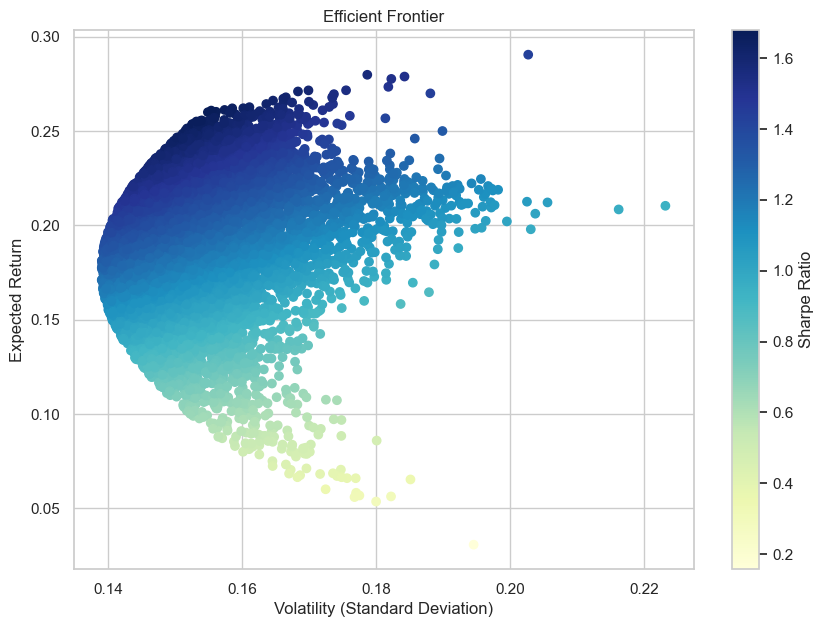

#### Key Insights

In this plot, each dot represents a portfolio, with the color indicating the Sharpe ratio, a key measure of risk-adjusted returns. Portfolios on the leftmost edge of the efficient frontier, near the y-axis, deliver the highest expected returns for a given level of volatility, representing optimal portfolios. The gradient indicates that portfolios with darker blue shades (higher Sharpe ratios) provide better risk-adjusted returns, highlighting the most efficient investment choices for balancing risk and reward.

### <h3 style="color:#4A90E2;">Identifying the Portfolio with the maximum Sharpe Ratio</h3> 

The portfolio with the maximum Sharpe ratio is the one that offers the best risk-adjusted return, meaning it provides the highest return for the least amount of risk. Identifying this portfolio is important because it helps investors optimize their asset allocation by choosing the portfolio that maximizes returns relative to the level of risk they are willing to take on. This ensures that the investor is receiving the best possible reward for their investment risk.

#### Code
``` python
max_sharpee_idx = np.argmax(results[2])
max_sharpee_return = results[0, max_sharpee_idx]
max_sharpee_volatility = results[1, max_sharpee_idx]
max_sharpee_ratio = results[2, max_sharpee_idx]

max_sharpee_return, max_sharpee_volatility, max_sharpee_ratio
```

#### Insights

The portfolio with the maximum Sharpe ratio has the following characteristics:

**Expected Return**: 26.08%  
**Volatility**: ~15.54%  
**Sharpe Ratio**: ~1.68

### <h3 style="color:#4A90E2;">Identifying the Weights of the Stocks in the Portfolio that yield the Maximum Sharpe ratio</h3> 

#### Code
``` python
max_sharpee_weights = np.zeros(len(df_tickers))

for i in range(num_portfolios):
    weights = np.random.random(len(df_tickers))
    weights /= np.sum(weights)

    portfolio_return, portfolio_volatility = portfolio_performance(weights, expected_returns, cov_matrix)

    if results[2, i] == max_sharpee_ratio:
        max_sharpee_weights = weights
        break

portfolio_weights_df = pd.DataFrame({
    'Ticker': df_tickers,
    'Weight': max_sharpee_weights
})

portfolio_weights_df
```

### Results

|**Ticker**|  **weight** 
|----------|----------|
| HDFCBANK.NS | 0.150016 |
|INFY.NS |0.135278 |
| RELIANCE.NS	| 0.337379 | 
| TCS.NS	 | 0.377326 | 

### Key Insights

The diversified portfolio has the following allocations:

**HDFCBANK: (30.85%)  
INFY: (10.59%)  
RELIANCE: (18.02%)  
TCS: (40.53%)**   

TCS has the largest allocation, highlighting its key role in driving the portfolio's performance, while INFY has the smallest allocation, reflecting a lower expected contribution. This balanced allocation strategy seeks to maximize returns while minimizing risk by capitalizing on the individual performances of the stocks and their correlations, ensuring the portfolio is well-diversified and less exposed to the volatility of any single stock.